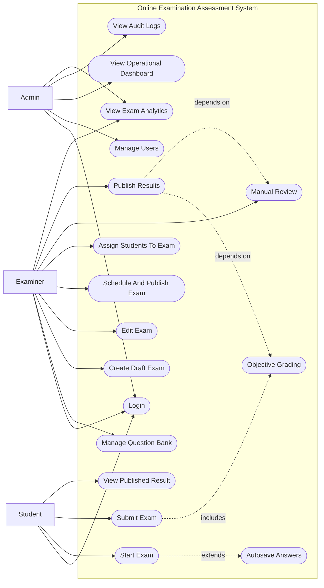

# 01. Use Case Diagram

## 1. Diagram Purpose

Show how the three system roles interact with the Online Examination Assessment System at a functional level.

## 2. Why It Matters For The Project

This diagram clarifies system scope, role boundaries, and the major capabilities expected from Admin, Examiner, and Student users. It is the fastest way to verify that the project’s role-based behavior matches `spec.md`.

## 3. Elements To Include

- actors:
  - Admin
  - Examiner
  - Student
- system boundary:
  - Online Examination Assessment System
- use cases:
  - Login
  - Manage Users
  - View Operational Dashboard
  - View Audit Logs
  - Manage Question Bank
  - Create Draft Exam
  - Edit Exam
  - Schedule And Publish Exam
  - Assign Students To Exam
  - View Exam Analytics
  - Start Exam
  - Autosave Answers
  - Submit Exam
  - View Published Result
  - Objective Grading
  - Manual Review
  - Publish Results

## 4. Relationships, Connections, And Arrows To Draw

- all actors connect to `Login`
- Admin connects to:
  - Manage Users
  - View Operational Dashboard
  - View Audit Logs
  - View Exam Analytics
- Examiner connects to:
  - Manage Question Bank
  - Create Draft Exam
  - Edit Exam
  - Schedule And Publish Exam
  - Assign Students To Exam
  - Manual Review
  - Publish Results
  - View Exam Analytics
- Student connects to:
  - Start Exam
  - Submit Exam
  - View Published Result
- `Autosave Answers` extends `Start Exam`
- `Submit Exam` includes `Objective Grading`
- `Publish Results` depends on `Objective Grading` completion and, where needed, `Manual Review`

## 5. Important Notes And Annotations

- treat Admin, Examiner, and Student as roles on one `User` model, not separate account systems
- audit logging is cross-cutting and should be annotated as applying to all sensitive operations
- `Manual Review` is conditional, not universal
- student access must always pass through authentication and assignment eligibility checks

## 6. Suggested Visual Grouping In Figma

- place actors on the left
- place the system boundary in the center
- group Admin operations at the top
- group Examiner operations in the middle
- group Student attempt and result operations at the bottom
- show grading and result publication as a shared backend cluster on the right within the system boundary

## 7. Textual Structured Diagram Definition

## 8. Common Mistakes To Avoid

- do not model internal services such as database or repositories as actors
- do not split user roles into separate user systems
- do not show students accessing unpublished results
- do not show result publication before grading and review are complete
- do not forget audit and authentication implications when converting into a polished visual
