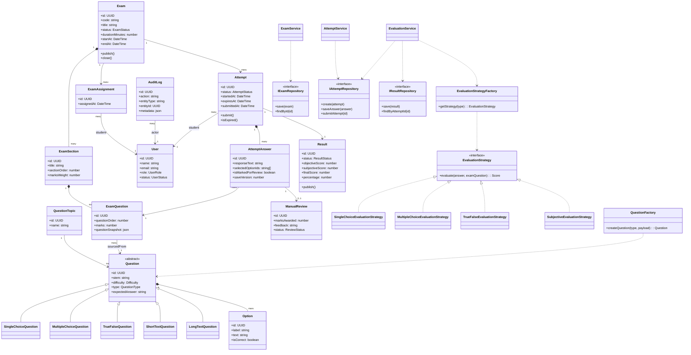

# 02. Class Diagram

## 1. Diagram Purpose

Describe the core domain objects, selected service abstractions, and design-pattern alignment of the system.

## 2. Why It Matters For The Project

This diagram ties the project directly to OOP, SOLID, and the required design patterns. It helps the team model the domain cleanly instead of scattering logic across pages and APIs.

## 3. Elements To Include

- domain classes:
  - User
  - Exam
  - ExamSection
  - QuestionTopic
  - Question
  - SingleChoiceQuestion
  - MultipleChoiceQuestion
  - TrueFalseQuestion
  - ShortTextQuestion
  - LongTextQuestion
  - Option
  - ExamQuestion
  - ExamAssignment
  - Attempt
  - AttemptAnswer
  - ManualReview
  - Result
  - AuditLog
- abstractions and services:
  - EvaluationStrategy
  - SingleChoiceEvaluationStrategy
  - MultipleChoiceEvaluationStrategy
  - TrueFalseEvaluationStrategy
  - SubjectiveEvaluationStrategy
  - EvaluationStrategyFactory
  - QuestionFactory
  - IExamRepository
  - IAttemptRepository
  - IResultRepository
  - ExamService
  - AttemptService
  - EvaluationService

## 4. Relationships, Connections, And Arrows To Draw

- `Question` is the abstract base for specific question types
- `Exam` composes `ExamSection`
- `ExamSection` aggregates ordered `ExamQuestion` records
- `Question` composes `Option` for objective variants
- `QuestionTopic` groups `Question`
- `ExamQuestion` references a bank question and stores exam-specific snapshot data
- `ExamAssignment` links one `Exam` to one student `User`
- `Attempt` belongs to one `Exam` and one student `User`
- `Attempt` composes many `AttemptAnswer`
- `AttemptAnswer` references one `ExamQuestion`
- `ManualReview` is attached to an `AttemptAnswer` when needed
- `Result` belongs to an `Attempt`
- application services depend on repository interfaces, not concrete database implementations
- `EvaluationService` depends on `EvaluationStrategyFactory`

## 5. Important Notes And Annotations

- inheritance should be shown primarily through question-type specialization
- the diagram should visually separate domain entities from service and repository abstractions
- repository interfaces demonstrate dependency inversion
- strategy objects should be shown as interchangeable evaluators selected by type
- `ExamQuestion` is the snapshot boundary that protects already-published exams from future edits to the bank question

## 6. Suggested Visual Grouping In Figma

- left cluster: domain entities and aggregates
- center cluster: question-type inheritance hierarchy
- right cluster: application services and repository abstractions
- bottom cluster: evaluation strategy family and factory

## 7. Textual Structured Diagram Definition

## 8. Common Mistakes To Avoid

- do not turn entities into active-record style database objects
- do not omit the question snapshot semantics of `ExamQuestion`
- do not place manual-review fields directly on `Attempt`
- do not blur domain entities and infrastructure adapters into one visual group
- do not forget that evaluation strategies are selected by question type, not hard-coded into the attempt page
