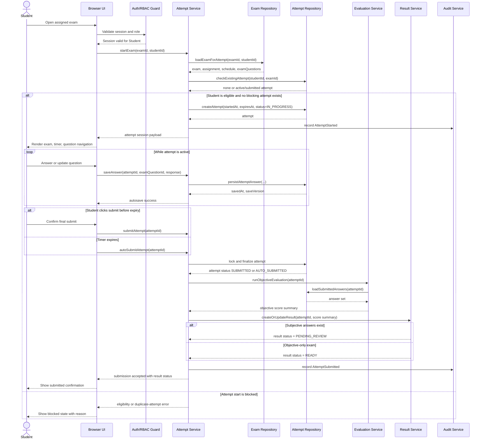

# 03. Sequence Diagram: Student Attempt

## 1. Diagram Purpose

Describe the full timed exam-taking sequence from access validation through autosave, submission, grading, and result-state generation.

## 2. Why It Matters For The Project

The attempt flow is the most sensitive runtime path in the system. It touches authentication, schedule validation, timer rules, autosave integrity, grading, and result state transitions.

## 3. Elements To Include

- Student
- Browser UI
- Auth/RBAC Guard
- Attempt Service
- Exam Repository
- Attempt Repository
- Evaluation Service
- Result Service
- Audit Service

## 4. Relationships, Connections, And Arrows To Draw

- student requests start from the browser UI
- auth guard validates session and role
- attempt service validates assignment, schedule, and prior-attempt rules
- exam repository loads exam snapshot
- attempt repository creates and updates attempt state
- evaluation service grades objective questions after submission
- result service creates or updates result state
- audit service records attempt start, autosave milestones, and submission

## 5. Important Notes And Annotations

- the server, not the client, is the authority for `expiresAt`
- autosave should be shown as a loop and not as a blocking interaction
- final submission must be idempotent
- subjective review should move the result to `PENDING_REVIEW`, not block the submission response indefinitely

## 6. Suggested Visual Grouping In Figma

- place user-facing participants on the left
- keep repositories in a narrower infrastructure band on the right
- use alt frames for success, blocked-start, and pending-review branches
- use loop frame for autosave

## 7. Textual Structured Diagram Definition

## 8. Common Mistakes To Avoid

- do not place timer truth entirely in the browser
- do not allow autosave after the attempt is finalized
- do not show subjective grading as synchronous inline work in the submission response
- do not omit the blocked-start branch for schedule or duplicate-attempt rules
- do not forget to record audit events on start and submit transitions
