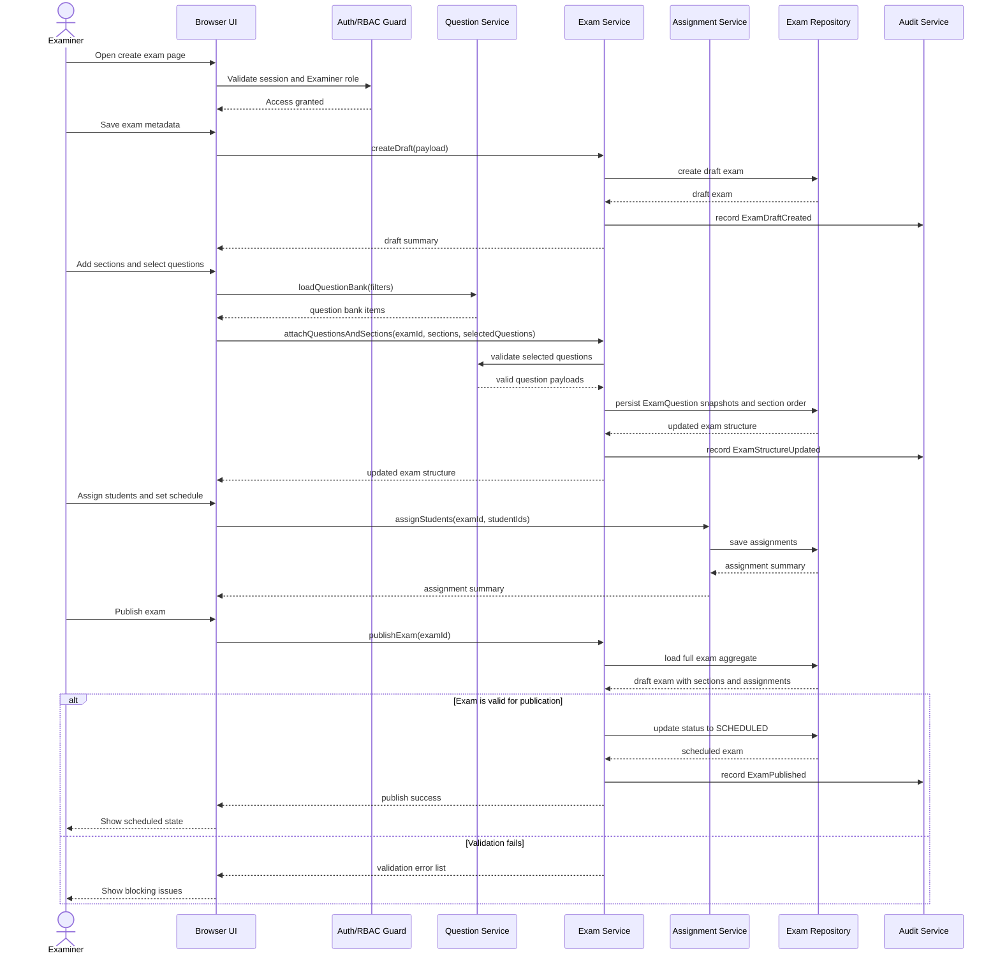

# 04. Sequence Diagram: Exam Creation

## 1. Diagram Purpose

Describe the end-to-end authoring and scheduling flow used by an Examiner to create a valid exam.

## 2. Why It Matters For The Project

Exam creation defines the data that drives the rest of the system. If this workflow is modeled weakly, the student attempt, grading, and reporting paths all become unstable.

## 3. Elements To Include

- Examiner
- Browser UI
- Auth/RBAC Guard
- Question Service
- Exam Service
- Assignment Service
- Exam Repository
- Audit Service

## 4. Relationships, Connections, And Arrows To Draw

- examiner initiates actions from the authoring UI
- auth guard validates ownership and role
- question service loads bank items and validates type-specific structures
- exam service creates draft, sections, and exam-question snapshots
- assignment service links selected students
- exam repository persists the final draft and schedule
- audit service records draft creation, updates, and publish events

## 5. Important Notes And Annotations

- published exams must not depend on mutable bank-question records alone
- student targeting should be explicit through assignments
- the system must validate schedule and required structure before publish
- draft save and publish are separate operations

## 6. Suggested Visual Grouping In Figma

- keep the examiner and browser on the left
- place question and exam services in the middle as the application layer
- place repository and audit on the right
- use alt frames for validation failure versus successful publish

## 7. Textual Structured Diagram Definition

## 8. Common Mistakes To Avoid

- do not publish an exam before questions, schedule, and assignments are valid
- do not rely on live question-bank records without exam snapshots
- do not skip assignment modeling and assume every student can attempt every exam
- do not collapse draft save and publish into one irreversible action
- do not forget audit entries for major exam-authoring events
