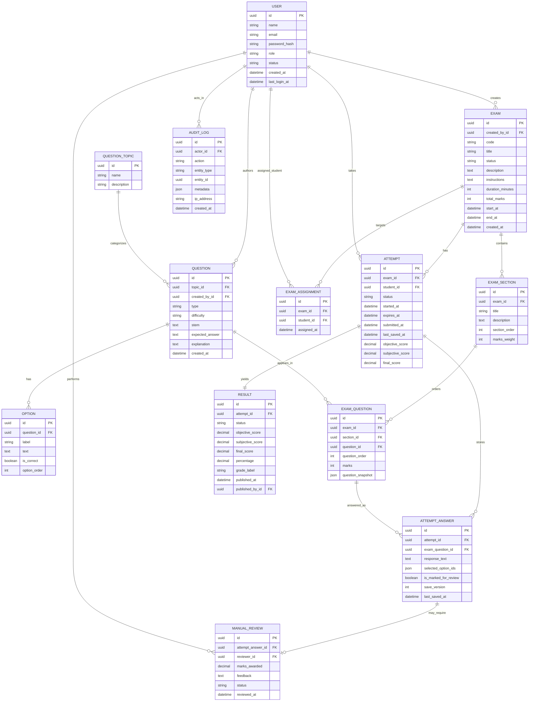

# 05. ER Diagram

## 1. Diagram Purpose

Show the practical database-level structure for the core entities and their relationships.

## 2. Why It Matters For The Project

The ER diagram gives the team a common reference for schema design, foreign keys, and cardinality. It is the main alignment tool between feature owners and data-layer implementation.

## 3. Elements To Include

- `User`
- `QuestionTopic`
- `Question`
- `Option`
- `Exam`
- `ExamSection`
- `ExamQuestion`
- `ExamAssignment`
- `Attempt`
- `AttemptAnswer`
- `ManualReview`
- `Result`
- `AuditLog`

## 4. Relationships, Connections, And Arrows To Draw

- one `User` creates many `Exam` records
- one `User` creates many `Question` records
- one `QuestionTopic` groups many `Question` records
- one `Question` can have many `Option` records
- one `Exam` has many `ExamSection` records
- one `ExamSection` has many `ExamQuestion` records
- one `Question` can appear in many `ExamQuestion` records
- one `Exam` has many `ExamAssignment` records
- one `Student User` can receive many `ExamAssignment` records
- one `Exam` has many `Attempt` records
- one `Student User` can have many `Attempt` records across exams
- one `Attempt` has many `AttemptAnswer` records
- one `AttemptAnswer` references one `ExamQuestion`
- one `AttemptAnswer` may have zero or one `ManualReview`
- one `Attempt` has exactly one `Result`
- one `AuditLog` references one actor `User`

## 5. Important Notes And Annotations

- show unique constraint intent for one assignment per `(examId, studentId)`
- show unique constraint intent for one result per `attemptId`
- `ExamQuestion` should be treated as the exam snapshot table, not just a thin join
- `AttemptAnswer` should reference `examQuestionId` so grading uses the exact question snapshot presented during the attempt

## 6. Suggested Visual Grouping In Figma

- left group: user and question bank entities
- center group: exam-authoring entities
- right group: attempt, grading, result, and audit entities
- keep join entities clearly visible instead of hiding them between larger boxes

## 7. Textual Structured Diagram Definition

## 8. Common Mistakes To Avoid

- do not remove join entities such as `EXAM_QUESTION` or `EXAM_ASSIGNMENT`
- do not connect students directly to exams without assignment modeling
- do not collapse `ATTEMPT_ANSWER` and `MANUAL_REVIEW` into one table in the visual
- do not forget one-to-one intent between `ATTEMPT` and `RESULT`
- do not omit audit metadata and actor linkage
