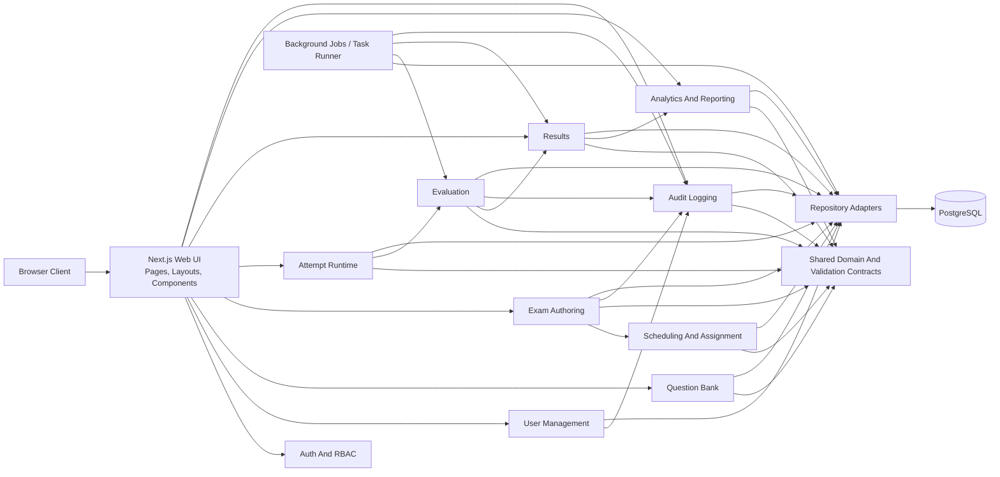

# 06. Component Diagram

## 1. Diagram Purpose

Show the logical modules of the modular monolith and how responsibilities flow between UI, application services, shared domain contracts, and persistence.

## 2. Why It Matters For The Project

This diagram prevents the team from accidentally building a tangled feature set. It reinforces clear module boundaries and shows where shared contracts and cross-cutting concerns belong.

## 3. Elements To Include

- Browser Client
- Next.js Web UI
- Auth And RBAC Module
- User Management Module
- Question Bank Module
- Exam Authoring Module
- Scheduling And Assignment Module
- Attempt Runtime Module
- Evaluation Module
- Results Module
- Analytics And Reporting Module
- Audit Logging Module
- Shared Domain And Validation Contracts
- Repository Adapters
- PostgreSQL
- Optional Background Jobs / Task Runner

## 4. Relationships, Connections, And Arrows To Draw

- browser talks to Next.js UI
- UI uses authenticated actions and route handlers
- modules depend on shared contracts, not each other’s database tables
- repository adapters are the only layer that talks directly to the database
- attempt runtime triggers evaluation
- evaluation updates results and emits audit events
- reporting reads from results, attempts, exams, and audit data through service boundaries

## 5. Important Notes And Annotations

- this is a modular monolith, not a microservice system
- background jobs are optional infrastructure helpers, not separate product modules
- audit logging can be event-driven inside the same codebase
- reporting should read stable post-submission data, not live mutable form state

## 6. Suggested Visual Grouping In Figma

- left: client and Next.js presentation
- center: business modules arranged by lifecycle from authoring to attempt to results
- bottom center: shared domain and validation contracts
- right: repository adapters and PostgreSQL
- lower right: background jobs and scheduled tasks

## 7. Textual Structured Diagram Definition

## 8. Common Mistakes To Avoid

- do not redraw this as separate deployable services
- do not allow modules to bypass shared contracts and query tables ad hoc
- do not place timer authority only in the client
- do not couple analytics directly to draft authoring state
- do not forget audit logging as a cross-cutting module
