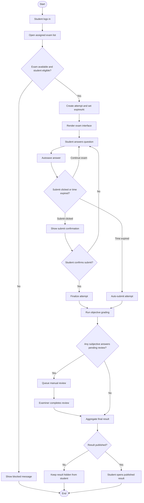

# 07. Activity Diagram: Exam Flow

## 1. Diagram Purpose

Show the high-level activity flow of a student exam attempt from eligibility checks through result visibility.

## 2. Why It Matters For The Project

This diagram captures the lifecycle logic in a single view. It is useful for explaining the system during project reviews and for confirming major decision points.

## 3. Elements To Include

- login and access exam list
- exam availability validation
- attempt creation
- answer loop
- autosave loop
- submit or timeout branch
- objective grading
- manual review decision
- result readiness
- publication
- result viewing

## 4. Relationships, Connections, And Arrows To Draw

- start node to login
- decision after exam selection for eligibility
- loop between answering and autosaving until submit or expiry
- branch from submission to objective-only result or pending manual review
- final publication gate before student can view result

## 5. Important Notes And Annotations

- distinguish autosave from final submit
- show timeout as a first-class branch, not a side note
- include manual review decision so the result publication rule stays explicit

## 6. Suggested Visual Grouping In Figma

- use swimlanes or colored group labels for:
  - Student
  - System
  - Examiner Review
  - Publication
- keep the main happy path vertical
- place decision branches to the side with return arrows where needed

## 7. Textual Structured Diagram Definition

## 8. Common Mistakes To Avoid

- do not skip the eligibility decision at exam start
- do not treat autosave as equivalent to submission
- do not forget timeout auto-submit
- do not let result visibility bypass publication control
- do not hide the manual review branch if subjective questions are in scope
