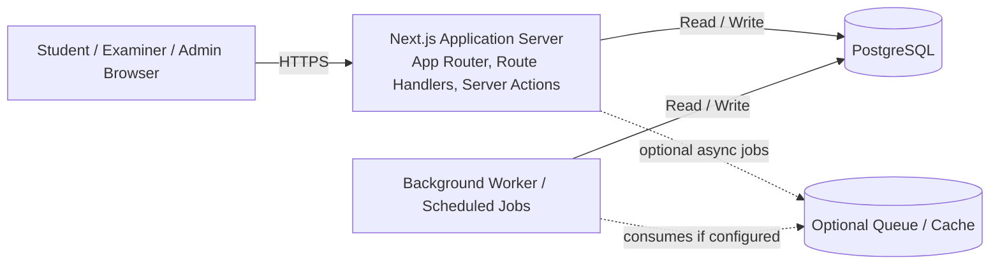

# 08. Deployment Diagram

## 1. Diagram Purpose

Show the practical runtime topology for deploying the system in a student-project-appropriate way.

## 2. Why It Matters For The Project

The deployment diagram grounds the architecture in something realistic. It makes clear that the project is a single deployable web application with supporting infrastructure, not an over-engineered distributed platform.

## 3. Elements To Include

- Browser Client
- Next.js Application Server
- Route Handlers / Server Actions runtime
- Background Worker or Scheduled Job runner
- PostgreSQL Database
- Optional cache or queue
- Optional external auth provider only if later adopted

## 4. Relationships, Connections, And Arrows To Draw

- browser connects to the Next.js app over HTTPS
- Next.js app reads and writes PostgreSQL
- Next.js app handles auth, RBAC, and all business routes
- worker or scheduled jobs read and write through the same persistence layer
- optional cache/queue supports retries or asynchronous work if added later

## 5. Important Notes And Annotations

- deployment remains a modular monolith
- timer authority and attempt state live on the server side through persistent state
- worker responsibilities may include schedule transitions, retryable grading work, or publication batches
- optional queue/cache should be marked as enhancement, not mandatory MVP

## 6. Suggested Visual Grouping In Figma

- top left: user device
- center: main Next.js runtime
- right: database and optional queue/cache
- bottom: worker or cron path
- annotate HTTPS and internal connections clearly

## 7. Textual Structured Diagram Definition

## 8. Common Mistakes To Avoid

- do not redraw the system as multiple independent backend services
- do not place timers or grading truth only in the browser
- do not omit persistent storage
- do not make the queue/cache appear mandatory for MVP delivery
- do not forget the worker path for scheduled transitions if you visualize automated exam opening or closing
